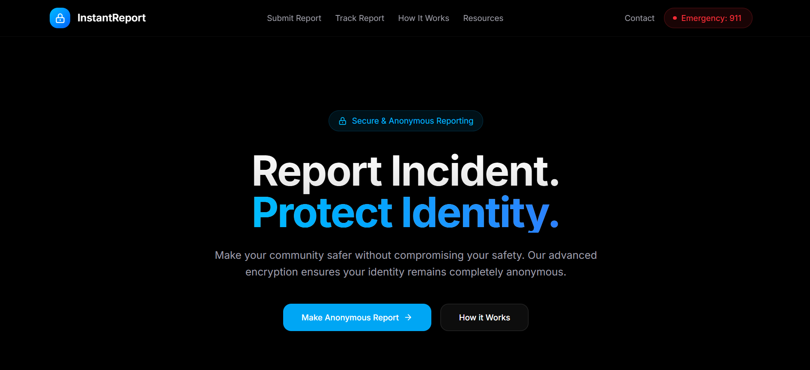

  <h1 align="center" id="top">QuickReport</h1>

  

    <b>Full-Stack Incident Reporting & Tracking Platform</b> 
    Authentication • Anonymous Reporting • Admin Dashboard • Reports Management
  

  
  
  
  
  
  

---

## 📚 Table of Contents

1. [Overview](#overview)
2. [Tech Stack](#tech-stack)
3. [Features](#features)
4. [Screenshots](#screenshots)
5. [References](#references)

---

## 🕵️ Overview 

QuickReport is a full-stack incident reporting and tracking platform. It lets users submit anonymous reports, track their status, and get AI-assisted incident descriptions powered by Google Gemini AI. The system includes role-based authentication, an admin dashboard, and a Prisma-backed database for secure report management.

---

## ⚙️ Tech Stack 

- **Frontend:** Next.js 15, TypeScript, Shadcn UI, Tailwind CSS
- **Backend:** Next.js API Routes
- **Database & ORM:** Prisma ORM with Neon Database
- **Authentication:** Next-Auth
- **AI Integration:** Gemini AI
- **Hosting:** Vercel

---

## 🔋 Features 

- **Full-Stack Development with Next.js** → End-to-end project with both frontend and backend in one framework
- **AI-Powered Reporting** → Gemini AI helps generate structured, detailed incident descriptions
- **Anonymous Reporting** → Secure submission of reports without exposing user identity
- **Responsive UI** → Tailwind CSS + Shadcn for pixel-perfect layouts across devices
- **Authentication** → Secure login and session management with NextAuth.js
- **Database Integration** → Prisma ORM for schema design, migrations, and queries
- **Security Infrastructure** → Strong protection of sensitive incident data

## 📸 Screenshots 

---

## 📚 References 

- **GitHub Repo:** [https://github.com/finishr08/QuickReport-...](https://github.com/finishr08/QuickReport-Incident-Reporting-System-) ⭐
- **Tailwind CSS:** [https://tailwindcss.com/](https://tailwindcss.com/)
- **Prisma ORM:** [https://www.prisma.io/](https://www.prisma.io/)
- **Next.js 15:** [https://nextjs.org/](https://nextjs.org/)
- **Google Gemini AI:** [https://ai.google.dev/](https://ai.google.dev/)
- **Neon Database:** [https://neon.tech/](https://neon.tech/)

---
